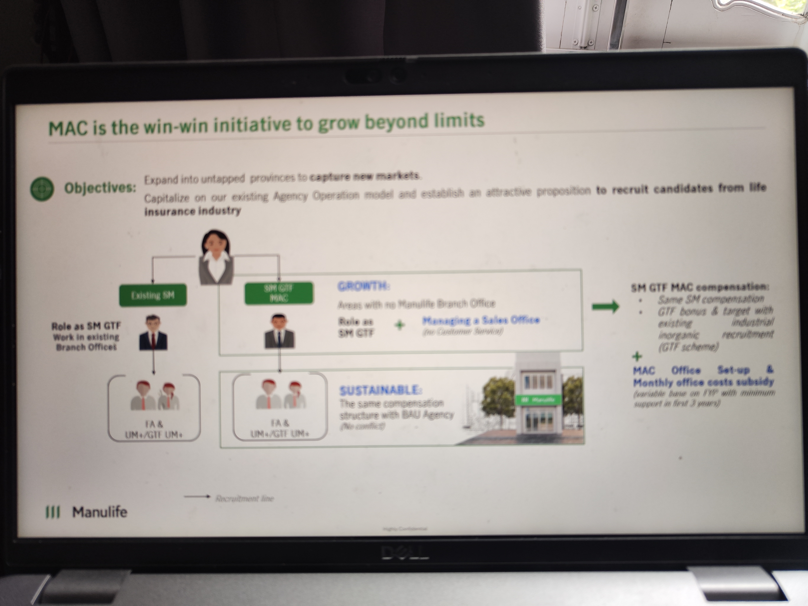

# MAC is the win-win initiative to grow beyond limits

*(Slide — Highly Confidential)*

*Note: IMG_20260209_121835.jpg is a clearer photo of the same slide.*

## Objectives:

- Expand into untapped provinces to **capture new markets**.
- Capitalize on our existing Agency Operation model and establish an attractive proposition **to recruit candidates from life insurance industry**

## Diagram: Existing SM vs SM GTF MAC

**Left side — Existing SM:**
- Role as SM GTF
- Work in existing Branch Offices
- Recruits: FA & UM+/GTF UM+

**Center — SM GTF MAC:**
- Role as SM GTF + **Managing a Sales Office** *(no Customer Service)*
- **GROWTH:** Areas with no Manulife Branch Office
- **SUSTAINABLE:** The same compensation structure with BAU Agency *(No conflict)*
- Recruits: FA & UM+/GTF UM+

→ *Recruitment line*

**Right side — SM GTF MAC compensation:**
- Same SM compensation
- GTF bonus & target with existing industrial inorganic recruitment (GTF scheme)

**+**

- **MAC Office Set-up & Monthly office costs subsidy** (variable base on FYP with minimum support in first 3 years)
