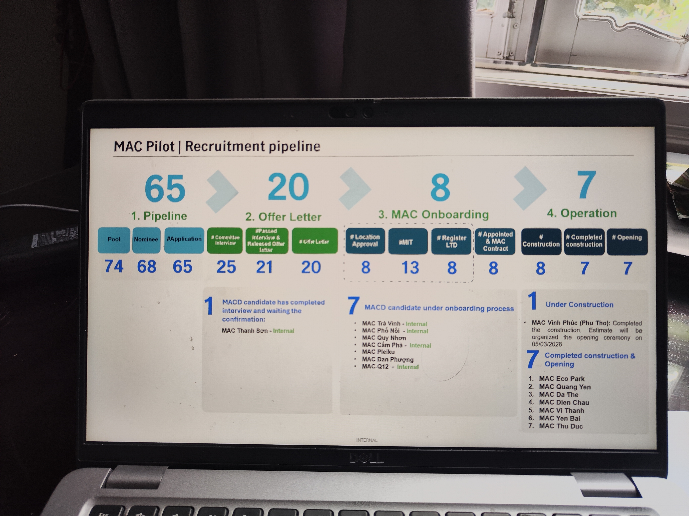

# MAC Pilot | Recruitment pipeline

*(Slide — Internal)*

## Funnel Overview

| Stage | Count |
|-------|-------|
| **1. Pipeline** | **65** |
| **2. Offer Letter** | **20** |
| **3. MAC Onboarding** | **8** |
| **4. Operation** | **7** |

## Stage Details

### 1. Pipeline

| Pool | Nominee | #Application |
|------|---------|-------------|
| 74 | 68 | 65 |

### 2. Offer Letter

| # Committee Interview | # Passed Interview & Released Offer Letter | # Offer Letter |
|----------------------|-------------------------------------------|---------------|
| 25 | 21 | 20 |

### 3. MAC Onboarding

| # Location Approval | # MIT | # Register LTD | # Appointed & MAC Contract |
|--------------------|-------|----------------|---------------------------|
| 8 | 13 | 8 | 8 |

### 4. Operation

| # Construction | # Completed construction | # Opening |
|---------------|------------------------|-----------|
| 8 | 7 | 7 |

---

## Notes

**1** MACD candidate has completed interview and waiting the confirmation:
- MAC Thanh Sơn - *Internal*

**7** MACD candidate under onboarding process:
- MAC Trà Vinh - *Internal*
- MAC Phố Nối - *Internal*
- MAC Quy Nhơn
- MAC Cẩm Phả - *Internal*
- MAC Pleiku
- MAC Đan Phượng
- MAC Q12 - *Internal*

**1** Under Construction:
- MAC Vĩnh Phúc (Phú Thọ): Completed the construction. Estimate will be organized the opening ceremony on 05/03/2026

**7** Completed construction & Opening:
1. MAC Eco Park
2. MAC Quang Yên
3. MAC Đa Thẻ
4. MAC Diễn Châu
5. MAC Vị Thanh
6. MAC Yên Bái
7. MAC Thủ Đức
