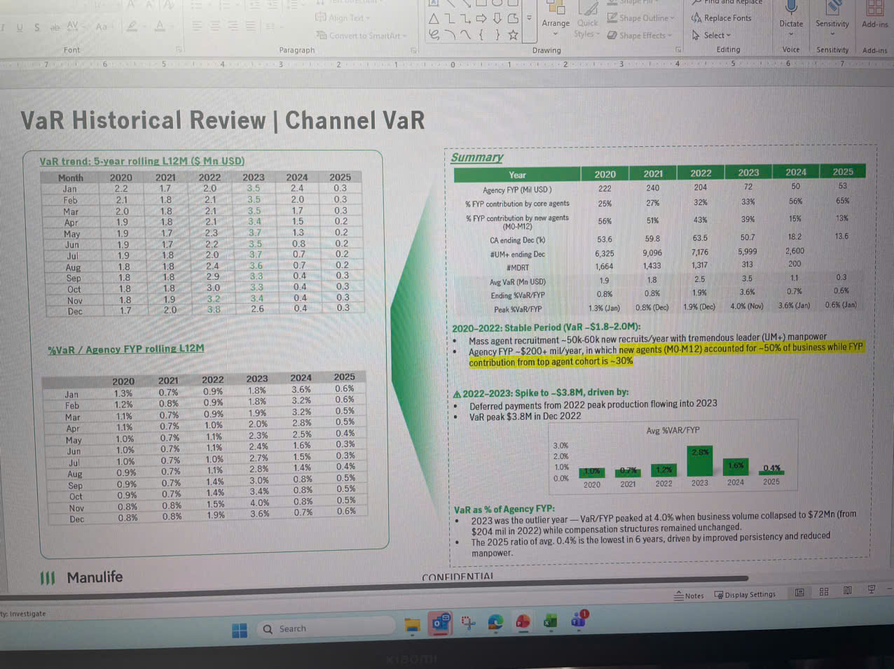

# VaR Historical Review | Channel VaR

## VaR trend: 5-year rolling L12M ($ Mn USD)

| Month | 2020 | 2021 | 2022 | 2023 | 2024 | 2025 |
|-------|------|------|------|------|------|------|
| Jan | 2.2 | 1.7 | 2.0 | 3.5 | 2.4 | 0.3 |
| Feb | 2.1 | 1.8 | 2.1 | 3.5 | 2.0 | 0.3 |
| Mar | 2.0 | 1.8 | 2.1 | 3.5 | 1.7 | 0.3 |
| Apr | 1.9 | 1.8 | 2.1 | 3.4 | 1.5 | 0.2 |
| May | 1.9 | 1.7 | 2.3 | 3.7 | 1.3 | 0.2 |
| Jun | 1.9 | 1.7 | 2.2 | 3.5 | 0.8 | 0.2 |
| Jul | 1.9 | 1.8 | 2.0 | 3.7 | 0.7 | 0.2 |
| Aug | 1.8 | 1.8 | 2.4 | 3.6 | 0.7 | 0.2 |
| Sep | 1.8 | 1.8 | 2.9 | 3.3 | 0.4 | 0.3 |
| Oct | 1.8 | 1.8 | 3.0 | 3.3 | 0.4 | 0.3 |
| Nov | 1.8 | 1.9 | 3.2 | 3.4 | 0.4 | 0.3 |
| Dec | 1.7 | 2.0 | 3.8 | 2.6 | 0.4 | 0.3 |

## %VaR / Agency FYP rolling L12M

| Month | 2020 | 2021 | 2022 | 2023 | 2024 | 2025 |
|-------|------|------|------|------|------|------|
| Jan | 1.3% | 0.7% | 0.9% | 1.8% | 3.6% | 0.6% |
| Feb | 1.2% | 0.8% | 0.9% | 1.8% | 3.2% | 0.6% |
| Mar | 1.1% | 0.7% | 0.9% | 1.9% | 3.2% | 0.5% |
| Apr | 1.1% | 0.7% | 1.0% | 2.0% | 2.8% | 0.5% |
| May | 1.0% | 0.7% | 1.1% | 2.3% | 2.5% | 0.4% |
| Jun | 1.0% | 0.7% | 1.1% | 2.4% | 1.6% | 0.3% |
| Jul | 1.0% | 0.7% | 1.0% | 2.7% | 1.5% | 0.3% |
| Aug | 0.9% | 0.7% | 1.1% | 2.8% | 1.4% | 0.4% |
| Sep | 0.9% | 0.7% | 1.4% | 3.0% | 0.8% | 0.5% |
| Oct | 0.9% | 0.7% | 1.4% | 3.4% | 0.8% | 0.5% |
| Nov | 0.8% | 0.8% | 1.5% | 4.0% | 0.8% | 0.5% |
| Dec | 0.8% | 0.8% | 1.9% | 3.6% | 0.7% | 0.6% |

*Green-shaded gradient area chart showing VaR trend declining from 2020 peak toward 2025*

## Summary

| Metrics | 2020 | 2021 | 2022 | 2023 | 2024 | 2025 |
|---------|------|------|------|------|------|------|
| Agency FYP (Mil USD) | 222 | 240 | 204 | 72 | 50 | 53 |
| % FYP contribution by core agents | 25% | 27% | 32% | 33% | 56% | 65% |
| % FYP contribution by new agents (MO-M12) | 56% | 51% | 43% | 39% | 15% | 13% |
| OA ending Dec (%) | 53.6 | 59.8 | 63.5 | 50.7 | 18.2 | 13.6 |
| #UM+ ending Dec | 6,325 | 9,096 | 7,176 | 5,999 | 2,600 | - |
| #MDRT | 1,664 | 1,433 | 1,317 | 313 | 200 | - |
| Avg VaR (Mn USD) | 1.9 | 1.8 | 2.5 | 3.5 | 1.1 | 0.3 |
| Ending %VaR/FYP | 0.8% | 0.8% | 1.9% | 3.6% | 0.7% | 0.6% |
| Peak %VaR/FYP | 1.3% (Jan) | 0.8% (Dec) | 1.9% (Dec) | 4.0% (Nov) | 3.6% (Jan) | 0.6% (Jan) |

### 2020-2022: Stable Period (VaR ~$1.8-2.0M):
- Mass agent recruitment ~50k-60k new recruits/year with tremendous leader (UM+) manpower
- Agency FYP ~$200+ mil/year, in which **new agents (MO-M12) accounted for ~50% of business while FYP contribution from top agent cohort is ~30%**

### ▲ 2022-2023: Spike to ~$3.8M, driven by:
- Deferred payment from 2022 peak production flowing into 2023
- VaR peak $3.8M in Dec 2022

*Bar chart showing Avg %VaR/FYP by year: 2020 (~1.0%), 2021 (~0.7%), 2022 (~1.1%), 2023 (~2.6%), 2024 (~1.6%), 2025 (~0.3%)*

### VaR as % of Agency FYP:
- 2023 was the outlier year — VaR/FYP peaked at 4.0% when business volume collapsed to $72Mn (from $204 mil in 2022) while compensation structures remained unchanged.
- The 2025 ratio of avg. 0.4% is the lowest in 6 years, driven by improved persistency and reduced manpower.

---

**|||** Manulife

CONFIDENTIAL
