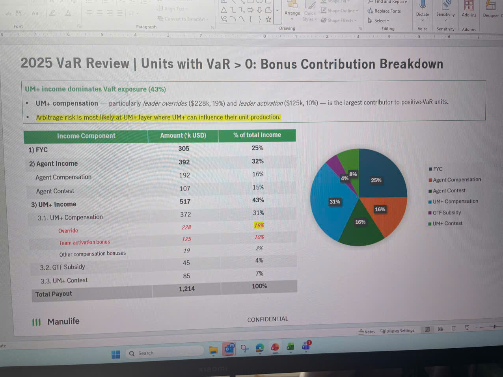

# 2025 VaR Review | Units with VaR > 0: Bonus Contribution Breakdown

## UM+ income dominates VaR exposure (43%)

- **UM+ compensation** — particularly *leader overrides* ($228k, 19%) and *leader activation* ($125k, 10%) — is the largest contributor to positive-VaR units.
- **Arbitrage risk is most likely at UM+ layer where UM+ can influence their unit production.**

| Income Component | Amount ('k USD) | % of total Income |
|-----------------|-----------------|-------------------|
| **1) FYC** | 305 | 25% |
| **2) Agent Income** | 392 | 32% |
| Agent Compensation | 192 | 16% |
| Agent Contest | 107 | 15% |
| **3) UM+ Income** | 517 | 43% |
| 3.1. UM+ Compensation | 372 | 31% |
| Override | *228* | *19%* |
| Team activation bonus | *125* | *10%* |
| Other compensation bonuses | 19 | 2% |
| 3.2. GTF Subsidy | 45 | 4% |
| 3.3. UM+ Contest | 85 | 7% |
| **Total Payout** | 1,214 | 100% |

*[Pie chart showing the breakdown of income components: FYC (25%, dark blue), Agent Compensation (16%, orange), Agent Contest (16%, green), UM+ Compensation (31%, teal), GTF Subsidy (4%, purple), UM+ Contest (8%, light green)]*

**CONFIDENTIAL**
