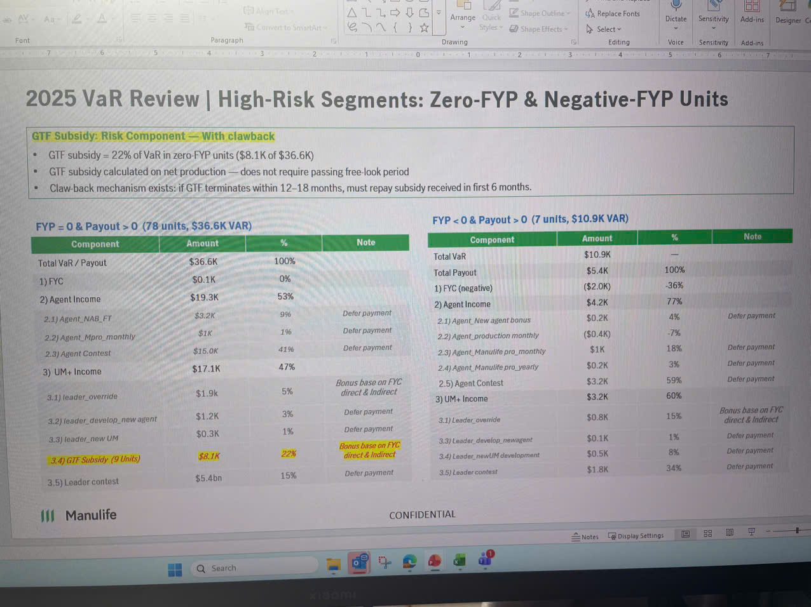

# 2025 VaR Review | High-Risk Segments: Zero-FYP & Negative-FYP Units

## GTF Subsidy: Risk Component — With clawback

- GTF subsidy = 22% of VaR in zero-FYP units ($8.1K of $36.6K)
- GTF subsidy calculated on net production — does not require passing free-look period
- Claw-back mechanism exists: if GTF terminates within 12–18 months, must repay subsidy received in first 6 months.

---

## FYP = 0 & Payout > 0 (78 units, $36.6K VAR)

| Component | Amount | % | Note |
|-----------|--------|---|------|
| Total VaR / Payout | $36.6K | 100% | |
| 1) FYC | $0.1K | 0% | |
| 2) Agent Income | $19.3K | 53% | |
| 2.1) Agent_NAB_FT | $3.2K | 9% | Defer payment |
| 2.2) Agent_Mpro_monthly | $1K | 1% | Defer payment |
| 2.3) Agent Contest | $15.0K | 41% | Defer payment |
| 3) UM+ Income | $17.1K | 47% | |
| 3.1) leader_override | $1.9k | 5% | Bonus base on FYC direct & Indirect |
| 3.2) leader_develop_new agent | $1.2K | 3% | Defer payment |
| 3.3) leader_new UM | $0.3K | 1% | Defer payment |
| **3.4) GTF Subsidy (9 Units)** | **$8.1K** | **22%** | **Bonus base on FYC direct & Indirect** |
| 3.5) Leader contest | $5.4bn | 15% | Defer payment |

---

## FYP < 0 & Payout > 0 (7 units, $10.9K VAR)

| Component | Amount | % | Note |
|-----------|--------|---|------|
| Total VaR | $10.9K | — | |
| Total Payout | $5.4K | 100% | |
| 1) FYC (negative) | ($2.0K) | -36% | |
| 2) Agent Income | $4.2K | 77% | |
| 2.1) Agent_New agent bonus | $0.2K | 4% | Defer payment |
| 2.2) Agent_production monthly | ($0.4K) | -7% | |
| 2.3) Agent_Manulife pro_monthly | $1K | 18% | Defer payment |
| 2.4) Agent_Manulife pro_yearly | $0.2K | 3% | Defer payment |
| 2.5) Agent Contest | $3.2K | 59% | Defer payment |
| 3) UM+ Income | $3.2K | 60% | |
| 3.1) Leader_override | $0.8K | 15% | Bonus base on FYC direct & Indirect |
| 3.3) Leader_develop_newagent | $0.1K | 1% | Defer payment |
| 3.4) Leader_newUM development | $0.5K | 8% | Defer payment |
| 3.5) Leader contest | $1.8K | 34% | Defer payment |

---

*Manulife logo visible at bottom left*

**CONFIDENTIAL**
