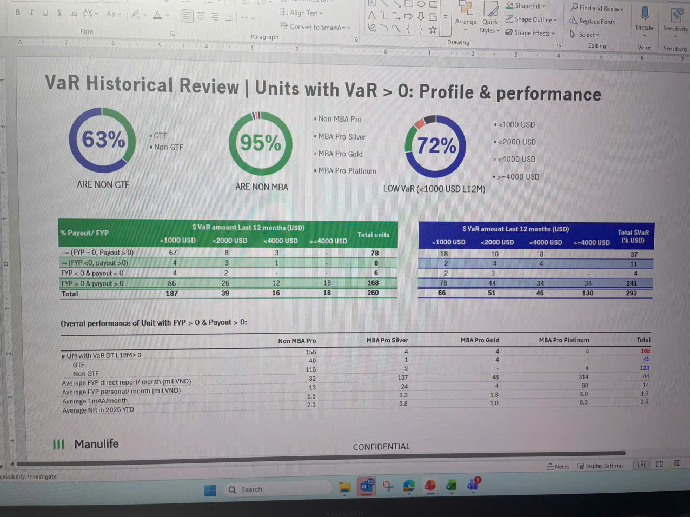

# VaR Historical Review | Units with VaR > 0: Profile & performance

*Three circular progress charts showing:*
- **63%** ARE NON GTF (split: GTF / Non GTF)
- **95%** ARE NON MBA (with legend: Non MBA Pro, MBA Pro Silver, MBA Pro Gold, MBA Pro Platinum)
- **72%** LOW VaR (<1000 USD L12M) (split by: <1000 USD, <2000 USD, <4000 USD, >=4000 USD)

## % Payout/ FYP

### $VaR amount Last 12 months (USD)

| % Payout/ FYP | <1000 USD | <2000 USD | <4000 USD | >=4000 USD | Total units |
|---------------|-----------|-----------|-----------|------------|-------------|
| += (FYP = 0, Payout > 0) | 67 | 8 | 3 | - | 78 |
| -= (FYP <0, payout >0) | 4 | 3 | 1 | - | 8 |
| FYP < 0 & payout < 0 | 4 | 2 | - | - | 6 |
| FYP > 0 & payout > 0 | 86 | 26 | 12 | 18 | 168 |
| **Total** | **187** | **39** | **16** | **18** | **260** |

### $VaR amount Last 12 months (USD)

| | <1000 USD | <2000 USD | <4000 USD | >=4000 USD | Total $VaR |
|---|-----------|-----------|-----------|------------|------------|
| | 18 | 10 | 8 | 1 | 37 |
| | 2 | 4 | 4 | - | 11 |
| | 2 | 3 | - | - | 4 |
| | 78 | 44 | 34 | 34 | 241 |
| | **66** | **51** | **46** | **130** | **293** |

## Overall performance of Unit with FYP > 0 & Payout > 0:

| | Non MBA Pro | MBA Pro Silver | MBA Pro Gold | MBA Pro Platinum | Total |
|---|-------------|----------------|--------------|------------------|-------|
| # UM with VaR DT L12M > 0 | 166 | 4 | 4 | 4 | 168 |
| GTF | 40 | 1 | 4 | - | 45 |
| Non GTF | 115 | 3 | - | 4 | 123 |
| Average FYP direct report/ month (mil VND) | 32 | 107 | 48 | 314 | 44 |
| Average FYP personal/ month (mil VND) | 13 | 24 | 4 | 60 | 14 |
| Average 1mAA/month | 1.5 | 3.3 | 1.8 | 5.0 | 1.7 |
| Average NR in 2025 YTD | 2.3 | 3.8 | 1.0 | 6.3 | 2.5 |

---

*Manulife logo bottom left*

CONFIDENTIAL
