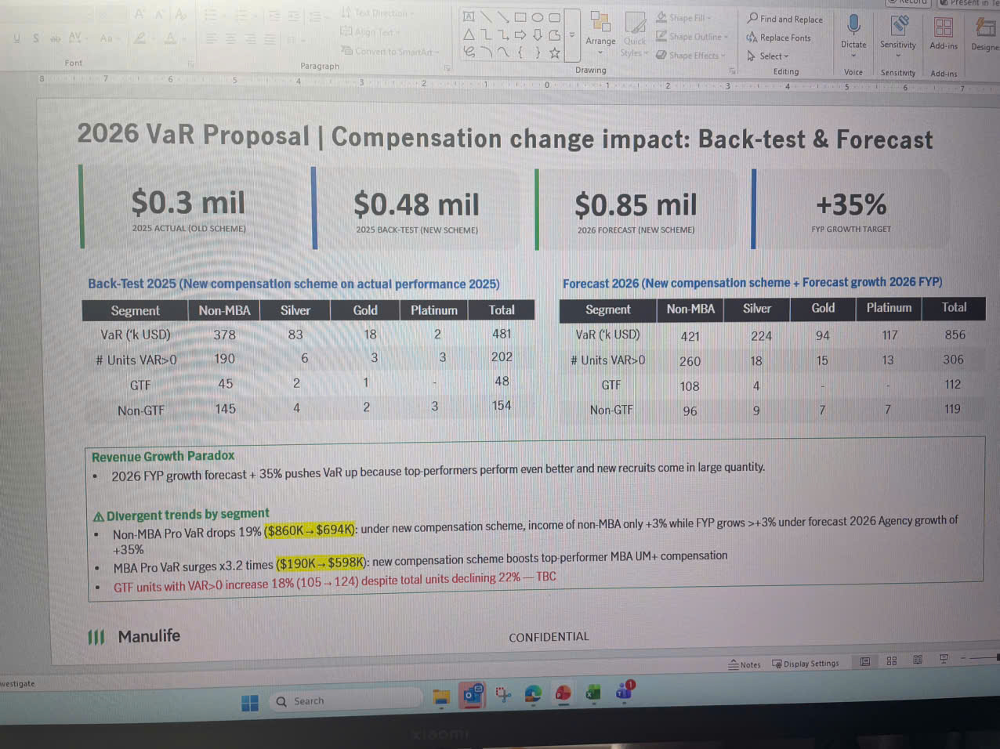

# 2026 VaR Proposal | Compensation change impact: Back-test & Forecast

## Key Metrics Overview

| Metric | Value | Description |
|--------|-------|-------------|
| **$0.3 mil** | 2025 ACTUAL (OLD SCHEME) | |
| **$0.48 mil** | 2025 BACK-TEST (NEW SCHEME) | |
| **$0.85 mil** | 2026 FORECAST (NEW SCHEME) | |
| **+35%** | FYP GROWTH TARGET | |

## Back-Test 2025 (New compensation scheme on actual performance 2025)

| Segment | Non-MBA | Silver | Gold | Platinum | Total |
|---------|---------|--------|------|----------|-------|
| VaR ('k USD) | 378 | 83 | 18 | 2 | 481 |
| # Units VAR>0 | 190 | 6 | 3 | 3 | 202 |
| GTF | 45 | 2 | 1 | - | 48 |
| Non-GTF | 145 | 4 | 2 | 3 | 154 |

## Forecast 2026 (New compensation scheme + Forecast growth 2026 FYP)

| Segment | Non-MBA | Silver | Gold | Platinum | Total |
|---------|---------|--------|------|----------|-------|
| VaR ('k USD) | 421 | 224 | 94 | 117 | 856 |
| # Units VAR>0 | 260 | 18 | 15 | 13 | 306 |
| GTF | 108 | 4 | - | - | 112 |
| Non-GTF | 96 | 9 | 7 | 7 | 119 |

## Revenue Growth Paradox

• 2026 FYP growth forecast + 35% pushes VaR up because top-performers perform even better and new recruits come in large quantity.

## △ Divergent trends by segment

• Non-MBA Pro VaR drops 19% **($860K→$694K)**: under new compensation scheme, income of non-MBA only +3% while FYP grows >+3% under forecast 2026 Agency growth of +35%

• MBA Pro VaR surges x3.2 times **($190K→$598K)**: new compensation scheme boosts top-performer MBA UM+ compensation

• **GTF units with VAR>0 increase 18% (105→124) despite total units declining 22% — TBC**

---

*Manulife logo appears in bottom left corner*

*CONFIDENTIAL watermark appears in bottom right*
