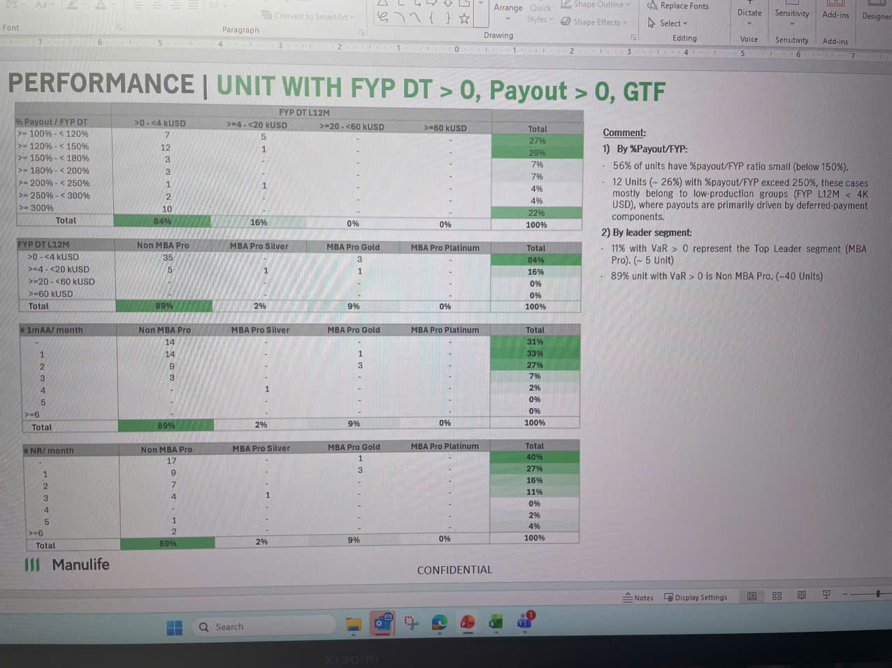

# PERFORMANCE | UNIT WITH FYP DT > 0, Payout > 0, GTF

## % Payout / FYP DT

### FYP DT L12M

| % Payout / FYP DT | >0 - <4 kUSD | >=4 - <20 kUSD | >=20 - <60 kUSD | >=60 kUSD | Total |
|-------------------|--------------|----------------|-----------------|-----------|-------|
| >= 100% - < 120% | 7 | 5 | - | - | 27% |
| >= 120% - < 150% | 12 | 1 | - | - | 29% |
| >= 150% - < 180% | 3 | - | - | - | 7% |
| >= 180% - < 200% | 3 | - | - | - | 7% |
| >= 200% - < 250% | 1 | 1 | - | - | 4% |
| >= 250% - < 300% | 2 | - | - | - | 4% |
| >= 300% | 10 | - | - | - | 22% |
| **Total** | **84%** | **16%** | **0%** | **0%** | **100%** |

## FYP DT L12M by Leader Segment

| FYP DT L12M | Non MBA Pro | MBA Pro Silver | MBA Pro Gold | MBA Pro Platinum | Total |
|-------------|-------------|----------------|--------------|------------------|-------|
| >0 - <4 kUSD | 35 | - | 3 | - | 84% |
| >=4 - <20 kUSD | 5 | 1 | 1 | - | 16% |
| >=20 - <60 kUSD | - | - | - | - | 0% |
| >=60 kUSD | - | - | - | - | 0% |
| **Total** | **89%** | **2%** | **9%** | **0%** | **100%** |

## # 1mAA/month

| # 1mAA/month | Non MBA Pro | MBA Pro Silver | MBA Pro Gold | MBA Pro Platinum | Total |
|--------------|-------------|----------------|--------------|------------------|-------|
| - | 14 | - | - | - | 31% |
| 1 | 14 | - | 1 | - | 33% |
| 2 | 9 | - | 3 | - | 27% |
| 3 | 3 | - | - | - | 7% |
| 4 | - | 1 | - | - | 2% |
| 5 | - | - | - | - | 0% |
| >=6 | - | - | - | - | 0% |
| **Total** | **89%** | **2%** | **9%** | **0%** | **100%** |

## # NR/month

| # NR/month | Non MBA Pro | MBA Pro Silver | MBA Pro Gold | MBA Pro Platinum | Total |
|------------|-------------|----------------|--------------|------------------|-------|
| - | 17 | - | 1 | - | 40% |
| 1 | 9 | - | 3 | - | 27% |
| 2 | 7 | - | - | - | 16% |
| 3 | 4 | 1 | - | - | 11% |
| 4 | - | - | - | - | 0% |
| 5 | 1 | - | - | - | 2% |
| >=6 | 2 | - | - | - | 4% |
| **Total** | **89%** | **2%** | **9%** | **0%** | **100%** |

## Comment:

### 1) By %Payout/FYP:
- 56% of units have %payout/FYP ratio small (below 150%).
- 12 Units (~ 26%) with %payout/FYP exceed 250%, these cases mostly belong to low-production groups (FYP L12M < 4K USD), where payouts are primarily driven by non-deferred-payment components.

### 2) By leader segment:
- 11% with VaR > 0 represent the Top Leader segment (MBA Pro). (~ 5 Unit)
- 89% unit with VaR > 0 is Non MBA Pro. (~40 Units)

---

*CONFIDENTIAL*

**|||** Manulife
