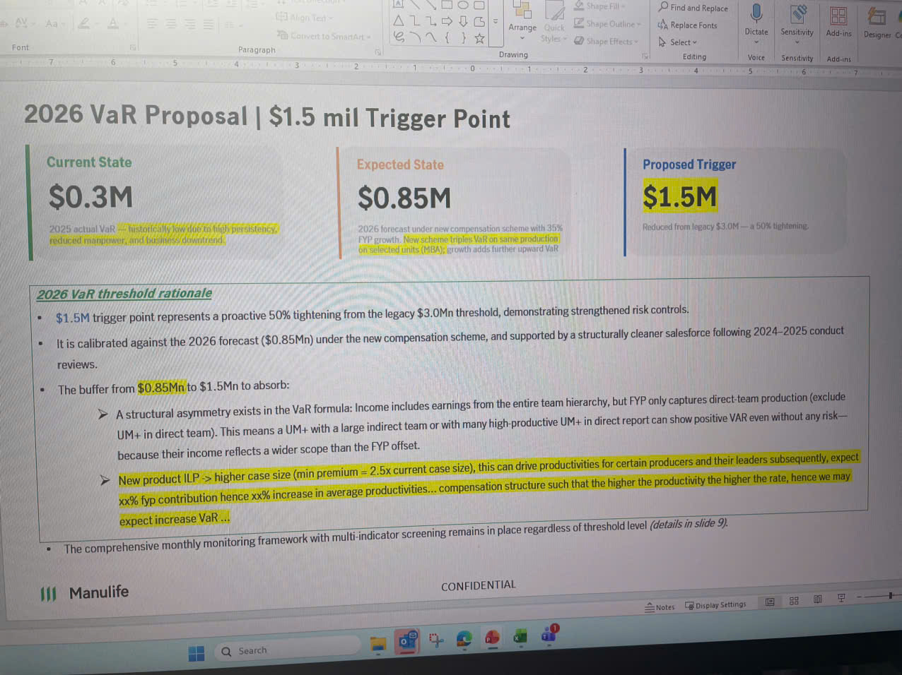

# 2026 VaR Proposal | $1.5 mil Trigger Point

## Current State
### $0.3M
2025 actual VaR is historically low due to high producer attrition, reduced manpower, and business downturn.

## Expected State
### $0.85M
2026 forecast under new compensation scheme with 35% FYP growth. New scheme triples VaR on same production on individual units (MDA); growth adds further upward VaR.

## Proposed Trigger
### $1.5M
Reduced from legacy $3.0M — a 50% tightening.

---

## 2026 VaR threshold rationale

• **$1.5M** trigger point represents a proactive 50% tightening from the legacy $3.0Mn threshold, demonstrating strengthened risk controls.

• It is calibrated against the 2026 forecast ($0.85Mn) under the new compensation scheme, and supported by a structurally cleaner salesforce following 2024–2025 conduct reviews.

• The buffer from **$0.85Mn** to $1.5Mn to absorb:

  ➢ A structural asymmetry exists in the VaR formula: Income includes earnings from the entire team hierarchy, but FYP only captures direct-team production (exclude UM+ in direct team). This means a UM+ with a large indirect team or with many high-productive UM+ in direct report can show positive VAR even without any risk—because their income reflects a wider scope than the FYP offset.

  ➢ New product ILP → higher case size (min premium = 2.5x current case size), this can drive productivities for certain producers and their leaders subsequently, expect xx% fyp contribution hence xx% increase in average productivities... compensation structure such that the higher the productivity the higher the rate, hence we may expect increase VAR ...

• The comprehensive monthly monitoring framework with multi-indicator screening remains in place regardless of threshold level *(details in slide 9)*.

---

*CONFIDENTIAL*
