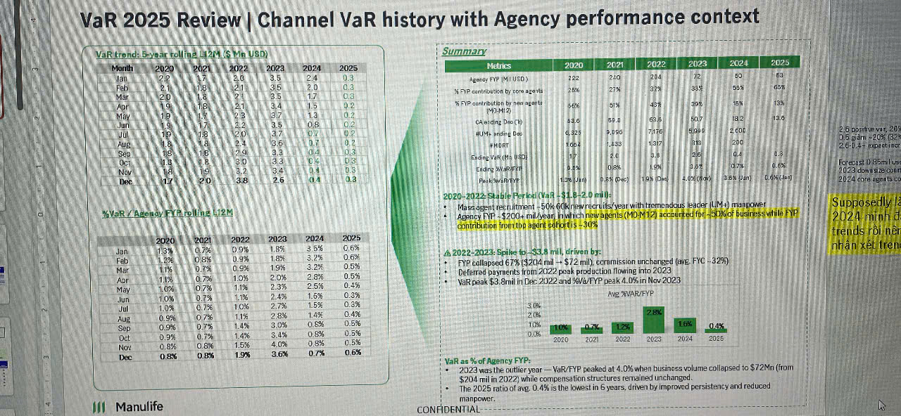

# VaR 2025 Review | Channel VaR history with Agency performance context

*Slide shows two data tables on the left showing VaR trends from 2020-2025, a green area chart in the center showing trend visualization, and a summary table on the right with highlighted findings in yellow*

## VaR trend: Even falling L12M & YA USD

| Month | 2020 | 2021 | 2022 | 2023 | 2024 | 2025 |
|-------|------|------|------|------|------|------|
| Jan | 2.1 | 0.6 | 2.1 | 4.6 | 2.0 | 0.3 |
| Feb | 0.4 | 0.5 | 0.4 | 3.5 | 2.0 | 0.3 |
| Mar | 0.9 | 1.6 | 1.1 | 3.6 | 1.1 | |
| Apr | 0.9 | 0.8 | 0.8 | 3.4 | 1.3 | 0.2 |
| May | 0.9 | 0.8 | 1.0 | 4.1 | 1.1 | |
| Jun | 1.0 | 0.9 | 1.1 | 3.6 | 0.8 | 0.2 |
| Jul | 0.9 | 0.9 | 2.0 | 3.5 | 0.8 | 0.2 |
| Aug | 0.8 | 0.8 | 2.1 | 3.2 | 1.1 | 0.2 |
| Sep | 1.0 | 1.6 | 2.4 | 3.7 | 0.7 | 0.2 |
| Oct | 1.8 | 1.4 | 3.0 | 3.3 | 0.5 | 0.3 |
| Nov | 1.8 | 1.5 | 3.1 | 3.4 | 0.5 | |
| Dec | 1.7 | 2.0 | 3.8 | 2.6 | 0.4 | 0.3 |

## %VaR based on AA falling L12M

| Month | 2020 | 2021 | 2022 | 2023 | 2024 | 2025 |
|-------|------|------|------|------|------|------|
| Jan | | | 0.9% | 1.8% | 3.3% | 0.6% |
| Feb | 1.8% | 0.5% | 0.9% | 1.8% | 3.2% | 0.6% |
| Mar | 1.1% | 1.7% | 0.5% | 1.9% | 3.3% | 0.5% |
| Apr | 1.1% | 0.7% | 1.0% | 2.0% | 2.8% | 0.5% |
| May | 1.0% | 0.7% | 1.1% | 2.3% | 2.6% | 0.4% |
| Jun | 1.0% | 0.7% | 1.2% | 2.4% | 1.9% | 0.3% |
| Jul | 1.0% | 0.7% | 1.0% | 2.7% | 1.5% | 0.3% |
| Aug | 0.9% | 0.7% | 1.1% | 2.8% | 1.4% | 0.4% |
| Sep | 0.9% | 0.9% | 1.4% | 3.0% | 0.8% | 0.5% |
| Oct | 0.9% | 0.7% | 1.4% | 3.4% | 0.5% | 0.5% |
| Nov | 0.8% | 0.8% | 1.6% | 4.0% | 0.5% | 0.5% |
| Dec | 0.8% | 0.8% | 1.9% | 3.6% | 0.7% | 0.6% |

## Summary

| Metrics | 2020 | 2021 | 2022 | 2023 | 2024 | 2025 |
|---------|------|------|------|------|------|------|
| Agency FYP (M) (USD) | 122 | 276 | 294 | 288 | 90 | 85 |
| % FYP contribution by new agents (MOM+2) | 28% | 37% | 39% | 39% | 39% | 40% |
| % FYP contribution by new agents (MOM+12) | 36% | 50% | 43% | 39% | 35% | 13% |
| CA ending Dec (#) | 13.6 | 9.5 | 9.8 | 10.7 | 13.6 | 13.6 |
| BUN_ending | 6.1 | 9,850 | 7,850 | 9,017 | 9,604 | | 
| # MDRT | 109 | 1,250 | 1,317 | 1,135 | 1,200 | | 
| Salary (M) (USD) | 9.4 | 11.5 | 13.0 | 13.9 | 10.7 | 0.83 |
| Yield | 31.8 | 406% | 46% | 43% | 42% | 6.6% |
| Persisitency | 120.0m | 0.91 (0m) | 102 (0m) | 1,910(0m) | 2,821 (0m) | 0.60 (3m) |

### 2020-2021: Strong performance (VaR < 1%) | **Mass agent recruitment +50k of AA; new recruits/year with tremendous leader (UM+) manpower Agency FYP +$204 mil/year from new agents (MOM+12) accounted for 50% FYP**

### 2022-2023: Spike to ~3.8 mil; driven by:
- FYP collapsed 67% ($204 mil → $72 mil); commission unchanged (avg. FNC = 329)
- Internal focus on tightness from AP (/not quality/ peak productivity flowing into 2023
- VaR peak 4.3 mil in Dec 2022 and %A/FYP peak 4.0% in Nov 2023

### Viet 2024-2025:

*Bar chart showing VaR percentages:*
- 2020: 1.0%
- 2021: 0.7%
- 2022: 1.2%
- 2023: VaR increased to peak
- 2024: 1.6%
- 2025: 0.4%

### VaR as % of Agency FYP:
- 2023 was the outlier year — VaR/FYP peaked at 4.0% when business volume collapsed to $72Mn (from $204 mil in 2022) while compensation structures remained unchanged.
- The 2025 ratio of avg. 0.4% is the lowest in 5 years, driven by improved persistency and reduced manpower.

CONFIDENTIAL

---

*Notes:*
- 2.0 mil in VaR, 3D
- 0.6m +2.6m Q2
- 0.4m +1.3m Q1
- Forecast 0.05m Jun
- Forecast 0.13m May
- 2024 core agent to
- (Manulife logo appears at bottom left)
