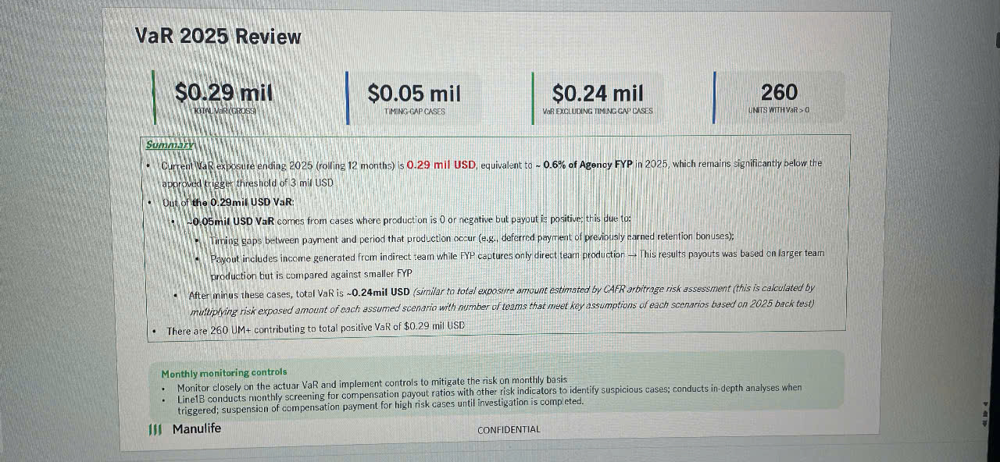

# VaR 2025 Review

*Four key metrics displayed as vertical bars at the top:*

| **$0.29 mil** | **$0.05 mil** | **$0.24 mil** | **260** |
|---------------|---------------|---------------|---------|
| TOTAL VaR (LOSS) | TIMING - CAP CASES | VaR EXCLUDING TIMING - CAP CASES | UNITS WITH VaR > 0 |

## Summary

• Overall VaR exposure ending 2025 (rolling 12 months) is **0.29 mil USD**, equivalent to **~0.6% of Agency FYP** in 2025, which remains significantly below the approved trigger threshold of 3 mil USD

• Out of the **0.29mil USD VaR**:
  - **~0.05mil USD VaR** comes from cases where production is 0 or negative but payout is positive; this due to:
    - Timing gaps between payment and period that production occur (e.g., deferred payment of previously earned retention bonuses);
    - Payout includes income generated from indirect team while FYP captures only direct team production → This results payouts was based on larger team production but is compared against smaller FYP
  - After minus these cases, total VaR is **~0.24mil USD** *(similar to total exposure amount estimated by CAFR arbitrage risk assessment (this is calculated by multiplying risk exposed amount of each assumed scenario with number of teams that meet key assumptions of each scenarios based on 2025 back test))*

• There are **260 UM+** contributing to total positive VaR of $0.29 mil USD.

## Monthly monitoring controls

• Monitor closely on the actual VaR and implement controls to mitigate the risk on monthly basis
• Line1B conducts monthly screening for compensation payout ratios with other risk indicators to identify suspicious cases; conducts in-depth analyses when triggered; suspension of compensation payment for high risk cases until investigation is completed.

---

*Manulife logo and "CONFIDENTIAL" watermark appear at bottom of slide*
