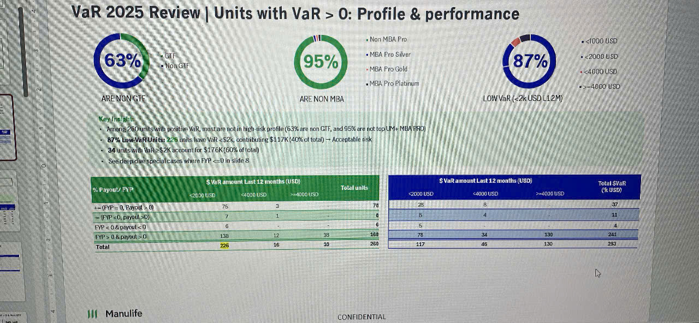

# VaR 2025 Review | Units with VaR > 0: Profile & performance

## Overview Metrics

*Three circular charts showing:*

**63%** ARE NON GTF
- GTF
- Non GTF

**95%** ARE NON MBA
- Non MBA Pro
- MBA Pro Silver
- MBA Pro Gold
- MBA Pro Platinum

**87%** LOW VAR (<2k USD (12M))
- <1000 USD
- <2000 USD
- <4000 USD
- >=4000 USD

## Key highlights

- Among 280 units with positive VaR, most are not in high-risk profile (63% are non GTF, and 95% are not top LVL+ MBA PRO)
- **87% Low-VaR Units** => 3 units have VaR ≤$2k, contributing $117K (40% of total) — Acceptable risk
- 34 units with VaR ≥$2k or top ($170K (60% of total))
- See relevant Special cases where FYP = 0 in slide 8

## $ VaR amount Last 12 months (USD)

| % Payout / FYP | <2k-20 USD | <4000 USD | >=4000 USD | Total units |
|----------------|-----------|-----------|------------|-------------|
| FYP = 0, Payout > 0 | 75 | 3 | - | 78 |
| FYP ≠0, Payout =0 | 7 | 1 | - | 8 |
| FYP < 0 & payout > 0 | 6 | - | - | 6 |
| FYP > 0 & payout > 0 | 138 | 12 | 18 | 168 |
| **Total** | **226** | **16** | **18** | **260** |

## $ VaR amount Last 12 months (USD)

| | <2000 USD | <4000 USD | >=4000 USD | Total $VaR (1000 USD) |
|----------------|-----------|-----------|------------|-------------|
| | 28 | 8 | - | 37 |
| | 6 | 4 | - | 11 |
| | 5 | - | - | 4 |
| | 76 | 34 | 130 | 241 |
| **Total** | **117** | **46** | **130** | **293** |

---

*Manulife logo*

CONFIDENTIAL
