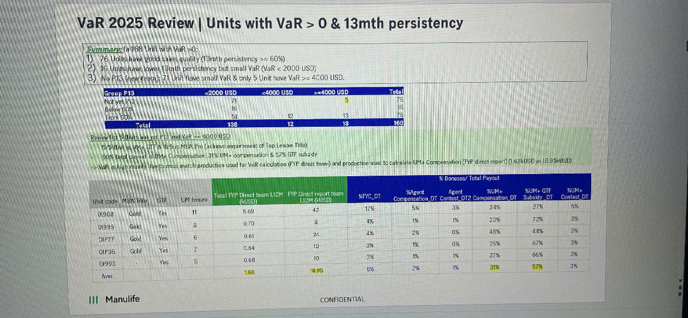

# VaR 2025 Review | Units with VaR > 0 & 13mth persistency

## Summary

In 168 Unit with VaR >0:
1) 76 Units have good sales quality (13mth persistency >= 60%)
2) 16 Units have lower 13mth persistency but small VaR (VaR < 2000 USD)
3) No PRA (new team): 71 Unit have small VaR & only 5 Unit have VaR >= 4000 USD.

### Units Distribution by VaR Range

| Group P13 | <2000 USD | <4000 USD | >=4000 USD | Total |
|-----------|-----------|-----------|------------|-------|
| Not yet P13 | 121 | 0 | 5 | 126 |
| Below 60% | 16 | 1 | 13 | 30 |
| From 60% | 1 | 12 | 13 | 26 |
| **Total** | **138** | **12** | **18** | **168** |

### Review list: 30 Units not yet P13 and VaR >= 4000 USD

- Σ without UM UM + DT & Below PRA (in achieve requirement of Top Leader Title).
- 94% trend of not UM+ Compensation: 51% UM+ compensation & 57% GTF subsidy
- > VaR is high mainly due to miss-match production used for VaR calculation (FYP direct team) and production used to calculate UM+ Compensation (FYP direct repo*) (1.68kUSD vs 18.99kUSD)

### Detailed Unit Analysis

| Unit code | PRA Title | GTF | UM Tenure | Total FYP Direct team L12M_DYE Direct repot team L12M (01DT) (MUSD) | | XFYP_DT | %Agent Compensation_DT | Agent Contest_DT | % Bonuses/ Total Payout %UM+ %UM+ GTF %UM+ Compensation_DT Subsidy_DT Contest_DT |
|-----------|-----------|-----|-----------|-------------------------------------------------------------------|---------|---------|----------------------|-----------------|-----------------------------------------------------------------------------|
| OI908 | Gold | Yes | 11 | 5.69 | 42 | | | 34% | 57% | 9% |
| | | | | | 9 | | | | | |
| OI995 | Gold | Yes | 5 | 0.70 | 9 | 4% | 1% | 1% | 25% | 72% | 3% |
| OI977 | Gold | Yes | 6 | 0.61 | 22 | 4% | 2% | 0% | 45% | 44% | 3% |
| OI936 | Gold | Yes | 7 | 0.64 | 10 | 3% | 1% | 0% | 25% | 67% | 3% |
| OI993 | | Yes | 6 | 0.68 | 10 | 3% | 1% | 1% | 27% | 66% | 3% |
| | | | | | | 5% | 1% | 1% | 31% | 57% | 3% |
| Aver. | | | | 1.68 | 18.99 | | | | | |

*Table includes green-highlighted columns showing "Total FYP Direct team L12M_FYP Direct report team L12M (01DT) (MUSD)" with values 42, 9, 22, 10, 10, and 18.99 (average)*

*Yellow-highlighted cells in bottom row show 1.68 and 18.99*

---

**III Manulife** 

**CONFIDENTIAL**
