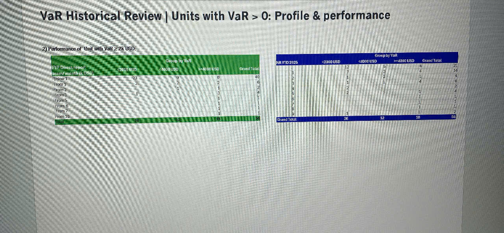

# VaR Historical Review | Units with VaR > 0: Profile & performance

## 2) Performance of Unit with VaR ≥ 2k USD:

*Two tables are shown side by side:*

### Left Table: Group by VaR (Green background)

| FYP Direct Tenor Year/Month Life Tier | <2000 USD | 2k-4k USD | >4000 USD | Grand Total |
|------------------------------------------|-----------|-----------|-----------|-------------|
| Below 1                                  | 23        | 9         | 8         | 40          |
| From 1                                   | 9         | 7         | 0         | 16          |
| From 2                                   | 3         | 1         | 1         | 5           |
| From 3                                   | 1         | 3         | 1         | 5           |
| From 5                                   | 1         | 1         | 1         | 3           |
| From 6                                   | -         | 1         | 0         | 1           |
| From 7                                   | -         | 0         | 1         | 1           |
| From 10                                  | 1         | -         | -         | 1           |
| Grand Total                              | 38        | 22        | 12        | 72          |

### Right Table: Group by VaR (Blue background)

| NA YTD 2025 | <2000 USD | <600K USD | >2000 USD | Grand Total |
|-------------|-----------|-----------|-----------|-------------|
| From 1      | 12        | 8         | 0         | 20          |
| From 10     | 1         | -         | -         | 1           |
| From 2      | 3         | 1         | 2         | 6           |
| From 3      | 3         | 1         | -         | 4           |
| From 5      | 1         | 1         | 1         | 3           |
| From 6      | -         | 1         | -         | 1           |
| From 7      | -         | -         | 1         | 1           |
| Grand Total | 20        | 12        | 4         | 36          |

*The tables show performance segmentation of units with VaR (Value at Risk) equal to or greater than 2,000 USD, broken down by FYP Direct Tenor Year/Month Life Tier and grouped into different VaR ranges. The left table appears to show historical data while the right table shows NA YTD 2025 data.*
