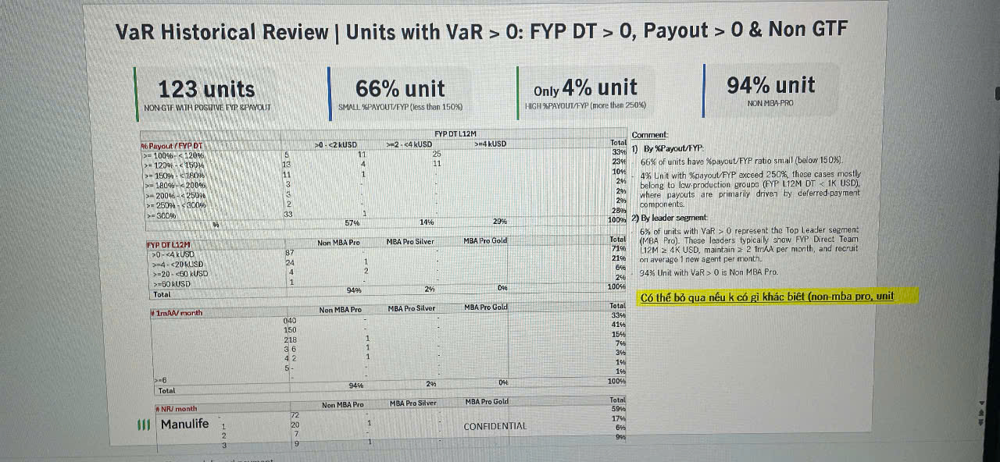

# VaR Historical Review | Units with VaR > 0: FYP DT > 0, Payout > 0 & Non GTF

## Key Statistics

**123 units**
NON GTF WITH POSITIVE FYP DT&PAYOUT

**66% unit**
(SMALL %PAYOUT/FYP (Less than 150%))

**Only 4% unit**
(HIGH %PAYOUT/FYP (More than 250%))

**94% unit**
(NON MBA PRO)

## Detailed Breakdown Tables

### % Payout / FYP DT

| Category | >0 - <2 kUSD | >=2 - <4 kUSD | >=4 kUSD | Total | Comment |
|----------|-------------|---------------|----------|--------|---------|
| >= 100% - < 120% | 5 | 11 | 28 | 44% | |
| >= 120% - < 150% | 16 | 4 | 31 | 23% | 1) By %Payout/FYP: |
| >= 150% - < 180% | 11 | 1 | 1 | 11% | 66% of units have %payout/FYP ratio small (below 150%). |
| >= 180% - < 200% | 3 | - | - | 2% | 4% Unit with %payout/FYP exceed 250% mainly |
| >= 200% - < 250% | 5 | - | - | 4% | belong to low-production groups (FYP L12M DT: < 1K USD), |
| >= 250% - < 500% | 2 | - | - | 2% | where payouts are primarily driven by deferred-payment |
| >= 500% | 43 | 1 | - | 2% | commissions. |
| Total | | 57% | 14% | 29% | 100% | 2) By leader segment: |

### FYP DT L12M

| Category | Non MBA Pro | MBA Pro Silver | MBA Pro Gold | Total | Comment |
|----------|-------------|----------------|--------------|--------|---------|
| >0 - <4 kUSD | 87 | - | - | 71% | 66% of units with VaR > 0 represent the Top Leader segment |
| >=4 - <20 kUSD | 24 | 1 | - | 21% | (MBA Pro). These leaders typically show: FYP Direct Team |
| >=20 - <50 kUSD | 4 | 2 | - | 6% | L12M >= 4K USD; maintains >= 2 1mAA per month; and recruit |
| >=50 kUSD | 1 | - | - | 2% | >= 2 1st years per month. |
| Total | | 94% | 2% | 0% | 100% | 94% Unit with VaR > 0 is Non MBA Pro. |

**Có thể bỏ qua nếu k có gì khác biệt (non mba pro, unit)**

### # 1mAA / month

| Category | Non MBA Pro | MBA Pro Silver | MBA Pro Gold | Total |
|----------|-------------|----------------|--------------|--------|
| 0~0 | - | - | - | 35% |
| 1~0 | - | - | - | 15% |
| 2~18 | - | 1 | - | 15% |
| 3-6 | - | 1 | - | 7% |
| 4-2 | - | 1 | - | 3% |
| 5-2 | - | - | - | 1% |
| >=6 | - | - | - | 1% |
| Total | | 94% | 2% | 0% | 100% |

### # NR / month

| | Non MBA Pro | MBA Pro Silver | MBA Pro Gold | Total |
|---|-------------|----------------|--------------|--------|
| **Manulife** 1 | 70 | - | - | 59% |
| 2 | 29 | 1 | - | 17% |
| 3 | 20 | - | CONFIDENTIAL | 6% |
| 3 | 9 | 1 | - | 9% |

*The table contains Manulife logo next to "# NR / month" heading*
