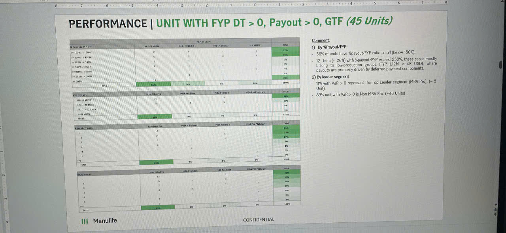

# PERFORMANCE | UNIT WITH FYP DT > 0, Payout > 0, GTF (45 Units)

*[The slide contains multiple data tables with horizontal bar charts showing distribution analysis]*

## % Payout/FYP DT

| Range | 2M4 FYP Payout | 2M4 < M8 (USD%) | 2M4 < 4.5M (USD%) | >4.5M (USD%) | Total |
|-------|----------------|-----------------|-------------------|--------------|-------|
| > = 150% + > 0 FYP% | 0 | 0 | 1 | 1 | 7% |
| > = 125% - < 150% | 0 | 0 | 4 | 5 | 7% |
| > = 100% - < 125% | 2 | 0 | 0 | - | 7% |
| > = 50% - < 100% | - | 0 | - | - | 4% |
| > = 10TM% - < 50% | - | - | - | - | 11% |
| < 10TM% | 1 | 1 | 0 | - | 7% |
| <= 100% | 13 | 6 | 8 | - | 60% |
| **Total** | **17** | **7** | **13** | **8** | **100%** |

*[Green horizontal bar chart showing ~60% concentration in the <= 100% range]*

## FYP DT LY M12

| Range | 2M4 FYP DT | 2M4 FYP for 2M4 | 2M4 FYP for 2M7 | 2M4 FYP Platform | Total |
|-------|------------|-----------------|-----------------|------------------|-------|
| <0 - ≤M M07 | 0 | 0 | 1 | - | 10% |
| >M - <M M 0.5% | - | 0 | - | 3 | 9% |
| >M.5 - <M 1% | - | 1 | - | - | 9% |
| >M 1 M 0% | - | - | - | - | 0% |
| **Total** | - | - | - | - | **100%** |

*[Green horizontal bar chart showing distribution, with ~70% in one category]*

## % VAR of Units

| Range | 2M4 FYP M DT% | 2M4 FYP for 2M4 | 2M4 FYP for M-4 | 2M4 FYP in Platform (DT) | Total |
|-------|---------------|-----------------|-----------------|--------------------------|-------|
| 0 | 14 | - | 1 | - | 31% |
| 1 | - | 14 | - | 1 | 31% |
| 2 | - | 0 | 1 | - | 11% |
| 3 | - | 0 | - | - | 7% |
| 4 | - | - | 3 | - | 2% |
| 5 | - | - | - | - | 0% |
| 6 | - | - | - | - | 0% |
| **Total** | - | - | - | - | **100%** |

*[Green horizontal bar chart showing 60% concentration at the top ranges]*

## % VAN (MAC M)

| Range | 2M4 FYP M DT% | 2M4 FYP for 2M4 | 2M4 FYP for 2M12 | 2M4 FYP Platform | Total |
|-------|---------------|-----------------|------------------|------------------|-------|
| 0 | 14 | 1 | - | - | 49% |
| 1 | - | 8 | 3 | - | 20% |
| 2 | - | 0 | - | - | 13% |
| 3 | - | - | 3 | - | 0% |
| 4 | - | 4 | 1 | - | 0% |
| 5 | - | - | - | - | 2% |
| 6 | - | - | 0 | - | 4% |
| **Total** | - | - | - | - | **100%** |

*[Green horizontal bar chart showing ~50% in first category, ~30% in second category]*

---

## Comment:

**1) By %Payout/FYP:**
- 9 cases of units have %payout/FYP ratio strat (below 150%).
- 12 Units (≈ 26%) with %payout/FYP exceed 250%, these cases mostly belong to low-production groups (FYP LTM < 4K USD), where Payouts are primarily driven by deferred-payment components.

**2) By leader segment:**
- 16 Units VAR > 0 represent the "top Leader segment" (MBA Pro.) (≈ 5 Unit)
- 89% unit with VaR > 0 is Non MBA Pro. (~40 Units)

---

*Manulife logo appears at bottom left*

**CONFIDENTIAL**
