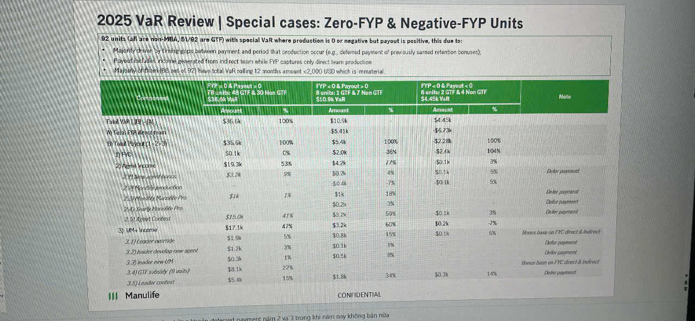

# 2025 VaR Review | Special cases: Zero-FYP & Negative-FYP Units

**82 units (all are non-PEA, 51/82 are GTF) with special VaR where production is 0 or negative but payout is positive, this due to:**

- Majority driven by timing gaps between payment and period that production occur (e.g., deferred payment of previously earned retention bonuses).
- Payout includes income generated from indirect team while FYP captures only direct team production
- Majority of units (82 out of 92) have total VaR rating 12 months amount <2,000 USD which is immaterial.

| Component | **FYP = 0 & Payout > 0** 79 units: 43 GTF & 36 Non GTF $38.6k VaR | | **FYP < 0 & Payout = 0** 3 units: 1 GTF & 7 Non GTF $10.9k VaR | | **FYP < 0 & Payout < 0** 0 units: 2 GTF & 4 Non GTF -$4.4k VaR | | **Note** |
|-----------|---------|------|---------|------|---------|------|----------|
| | **Amount** | **%** | **Amount** | **%** | **Amount** | **%** | |
| **Total VaR (1+3 + 4)** | $36.6k | 100% | $10.9k | | -$4.4k | | |
| **VaR Total FYP direct team** | | | $5.4k | | -$6.7k | | |
| **1) Total Payout (1.1 + 1.2)** | $36.6k | 100% | $5.4k | 100% | -$2.2k | 100% | |
| **1) FYC** | $0.1k | 0% | $2.0k | 38% | $2.4k | 100% | |
| **2) Agent Subsidy** | $19.3k | 53% | $4.2k | 77% | $0.1k | 3% | |
| *2.1) New insurance* | $3.2k | 9% | $0.2k | 4% | $0.1k | 5% | *Defer payment* |
| *2.2) GTF/PF production* | | | $0.3k | 7% | $0.1k | 5% | |
| *2.3) Non-PFP Portable PID* | $7k | 2% | $1k | 18% | | | *Defer payment* |
| *2.4) Hourly baseline Pln* | | | $0.2k | 3% | | | *Defer payment* |
| *2.5) Agent Contest* | $15.0k | 41% | $3.2k | 59% | -$0.1k | 3% | *Defer payment* |
| **3) UM+ Income** | $17.1k | 47% | $1.2k | 60% | -$0.2k | 7% | *Bonus base on FYC direct & Indirect* |
| *3.1) sm/um income* | $1.0k | 3% | $0.8k | 15% | -$0.1k | 6% | *Bonus base on FYC direct & Indirect* |
| *3.2) leader develop new agent* | $1.2k | 3% | $0.1k | 1% | | | *Defer payment* |
| *3.3) leader new UM* | $0.3k | 1% | $0.5k | 8% | | | *Defer payment* |
| *3.4) GTF subsidy (2 yrs)* | $8.1k | 22% | | | | | *Bonus base on FYC direct & Indirect* |
| *3.5) Leader contest* | $5.4k | 15% | $1.8k | 34% | $0.3k | 14% | *Defer payment* |

**CONFIDENTIAL**

*Note: khoanh chánanh quá khi năm nay không bán nữa*
