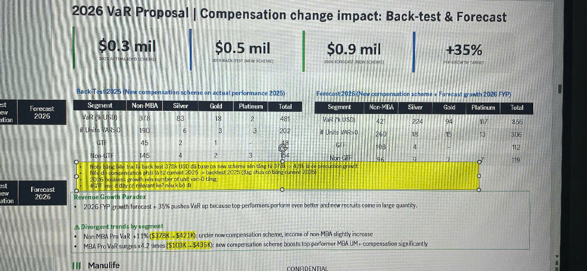

# 2026 VaR Proposal | Compensation change impact: Back-test & Forecast

## Summary Metrics

| Metric | Value | Description |
|--------|-------|-------------|
| **$0.3 mil** | | 2025 ACTUAL OLD SCHEME |
| **$0.5 mil** | | 2025 BACK-TEST NEW SCHEME |
| **$0.9 mil** | | 2026 FORECAST NEW SCHEME |
| **+35%** | | FYP GROWTH TARGET |

---

## Back-test 2025 (New compensation scheme on actual performance 2025)

| Segment | Non-MBA | Silver | Gold | Platinum | Total |
|---------|---------|--------|------|----------|-------|
| **VaR ('000 USD)** | 378 | 83 | 18 | 2 | 481 |
| **# Units VaR>0** | 190 | 6 | 3 | 3 | 202 |
| **GTF** | 45 | 2 | 1 | - | 48 |
| **Non-GTF** | 145 | 4 | 2 | 3 | 154 |

---

## Forecast 2026 (New compensation scheme + Forecast growth 2026 FYP)

| Segment | Non-MBA | Silver | Gold | Platinum | Total |
|---------|---------|--------|------|----------|-------|
| **VaR ('000 USD)** | 421 | 224 | 94 | 117 | 856 |
| **# Units VaR>0** | 260 | 18 | 15 | 13 | 306 |
| **GTF** | 168 | 9 | 8 | 7 | 192 |
| **Non-GTF** | 96 | 9 | 7 | 7 | 119 |

---

## Key Notes *(highlighted in yellow box)*

**Note tăng vọt trả lại back-test $378K USD do base on new scheme nhằm tăng IV $1M (% giá trị dự toán gần đúng với:**
- Nếu dùng compensation mới thì current 2025 -> backtest 2025 (tính chi trả compensation tương xứng với tương ứng với sự gia tăng gần đúng với số lượng unit var>0 tăng).
- 2026 business growth tiên number of unit var>0 tăng.
- **#GTF unit 0 dày có relative large quantity.**

---

## Revenue Growth Paradox

• 2026 FYP growth forecast +35% pushes VaR up because top-performers perform even better and new recruits come in large quantity.

---

## Δ Divergent trends by segment

• **Non-MBA Pro VaR +11%** ($378K → $421K): under new compensation scheme, income of non-MBA slightly increase

• **MBA Pro VaR surges x4.2 times** ($103K → $435K): new compensation scheme boosts top performer MBA UM+ compensation significantly

---

*Manulife logo visible at bottom left*

*"CONFIDENTIAL" watermark at bottom right*
