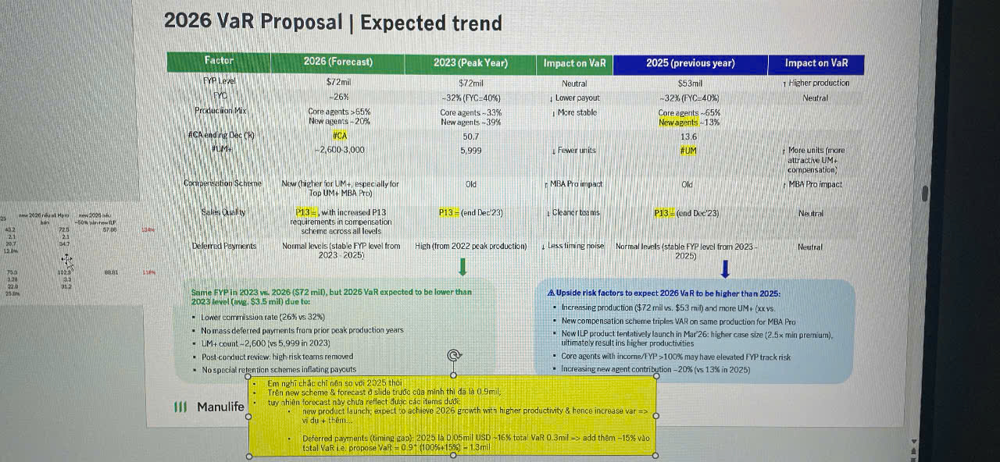

# 2026 VaR Proposal | Expected trend

| Factor | 2026 (Forecast) | 2023 (Peak Year) | Impact on VaR | 2025 (previous year) | Impact on VaR |
|--------|-----------------|------------------|---------------|----------------------|---------------|
| **FYP Level** | $72mil | $92mil | Neutral | $53mil | ↑ Higher production |
| | ~26% | ~32% (YIC~40%) | ↓ Lower payout | ~32% (YIC~40%) | Neutral |
| **Production Mix** | Core agents ~55%   New agents ~20% | Core agents ~33%   New agents ~10% | ↑ More stable | Core agents ~65%   New agents ~13% | |
| **#GA/MA/ing Dec PD** | #GA | 50.7 | | 13.6 | ↑ More units (more |
| | 2,600-3,000 | 5,999 | ↓ Fewer units | #UM | attractive UM+ compensation) |
| **Compensation Scheme** | New (higher for UM+, especially for Top UM, MBA Pro) | Old | ↑ MBA Pro impact | Old | ↑ MBA Pro impact |
| **Sales Quality** | Pt 13+ with increased Pt13 requirements in compensation scheme across all levels | Pt13+ (end Dec'23) | ↑ Cleaner teams | Pt13+ (end Dec'23) | Neutral |
| **Deferred Payments** | Normal levels (stable FYP level from 2025 - 2026) | High (from 2022 peak production) | ↓ Less timing noise | Normal levels (stable FYP level from 2023 - 2025) | Neutral |

---

**↓ Same FYP in 2023 vs. 2026 ($72 mil), but 2026 VaR expected to be lower than 2023 level (was $3.5 mil) due to:**

- Lower commission rate (26% vs 32%)
- No mass deferred payments from prior peak production years
- UM+ count ~2,600 (vs 5,999 in 2023)
- Post-conduct review: high-risk items removed
- No special retention schemes inflating payouts

---

**△ Upside risk factors to expect: 2026 VaR to be higher than 2025:**

- Increasing production ($72 mil vs. $53 mil) and more UM+ (vs vs.
- New compensation scheme triples VaR on same production for MBA Pro
- New ILP product tentatively launch in Mar'26: higher case size (2.5x min premium), primarily result ins higher productivities
- Core agents with income/FYP >100% may have elevated FYP track risk
- Increasing new agent contribution ~20% (vs 13% in 2025)

---

*Yellow highlighted box at bottom contains detailed text:*

- Em nghĩ chế chỉ nên so với 2025 thôi
- Trên new scheme, chỉ new scheme ko phải thêm những thứ khác như tk ở đây nữa
- Lấy thêm 1 vế so sánh mà chỉ reflect thực tế làm sao ddon tương lai
- Có new ILP product launch, expect to achieve 2026 growth with higher productivity & hence increase var => vì dụ + thêm...
- Deferred payments (timing gap): 2025 tụi 0.05mil USD ~16% total VaR( 0.3mil => add thêm ~15% vào total VaR i.e. propose VaR = 0.91 (100%+15%) =13mil
