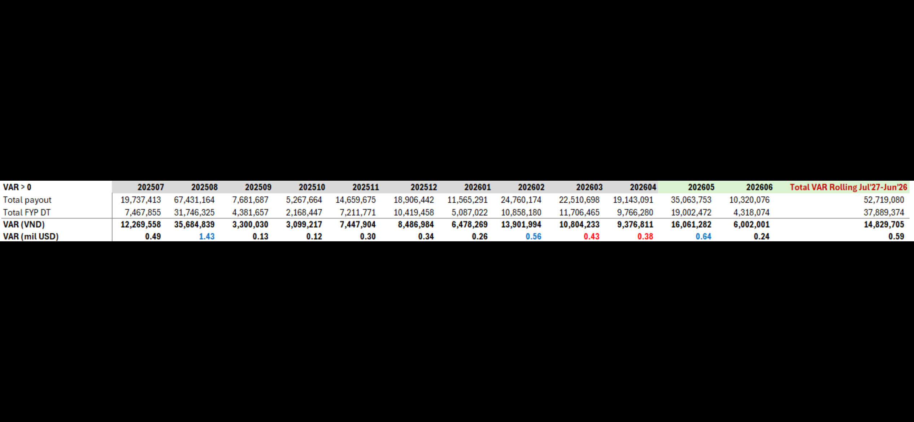

# VAR > 0

| VAR > 0 | 202507 | 202508 | 202509 | 202510 | 202511 | 202512 | 202601 | 202602 | 202603 | 202604 | 202605 | 202606 | Total VAR Rolling Jul'27-Jun'26 |
|---|---|---|---|---|---|---|---|---|---|---|---|---|---|
| Total payout | 19,737,413 | 67,431,164 | 7,681,687 | 5,267,664 | 14,659,675 | 18,906,442 | 11,565,291 | 24,760,174 | 22,510,698 | 19,143,091 | 35,063,753 | 10,320,076 | 52,719,080 |
| Total FYP DT | 7,467,855 | 31,746,325 | 4,381,657 | 2,168,447 | 7,211,771 | 10,419,458 | 5,087,022 | 10,858,180 | 11,706,465 | 9,766,280 | 19,002,472 | 4,318,074 | 37,889,374 |
| **VAR (VND)** | **12,269,558** | **35,684,839** | **3,300,030** | **3,099,217** | **7,447,904** | **8,486,984** | **6,478,269** | **13,901,994** | **10,804,233** | **9,376,811** | **16,061,282** | **6,002,001** | **14,829,705** |
| **VAR (mil USD)** | **0.49** | **1.43** | **0.13** | **0.12** | **0.30** | **0.34** | **0.26** | **0.56** | **0.43** | **0.38** | **0.64** | **0.24** | **0.59** |

*Note: Some VAR (mil USD) values are highlighted in red (1.43, 0.56, 0.43, 0.38, 0.64) and the final total (0.59) appears in green.*
