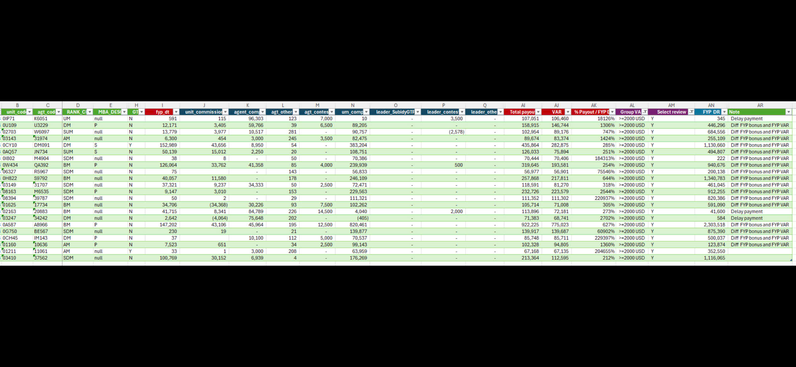

# Spreadsheet Data — Agent/Unit Compensation Details

*This image shows a spreadsheet (likely Excel) with multiple columns of data related to agent and unit compensation. Rows are highlighted in alternating light green shading.*

| B (unit_code) | C (agt_code) | D (RANK_C) | E (MBA_DESC) | H (GT) | I (fyp dt) | J (unit_commission) | K (agent_com) | L (agt_other) | M (agt_contes) | N (um_comp) | O (leader_SubsidyGTF) | P (leader_contes) | Q (leader_othe) | AI (Total payout) | AJ (VAR) | AK (% Payout / FYP) | AL (Group VA) | AM (Select review) | AN (FYP DR) | AR (Note) |
|---|---|---|---|---|---|---|---|---|---|---|---|---|---|---|---|---|---|---|---|---|
| 0IP71 | K6051 | UM | null | N | 591 | 115 | 96,303 | 123 | 7,000 | 10 | - | 3,500 | - | 107,051 | 106,460 | 18126% | >=2000 USD | Y | 345 | Delay payment |
| 0U109 | U3229 | DM | P | N | 12,171 | 3,405 | 59,766 | 39 | 6,500 | 89,205 | - | - | - | 158,915 | 146,744 | 1306% | >=2000 USD | Y | 446,296 | Diff FYP bonus and FYP VAR |
| 02703 | W6097 | SUM | null | N | 13,779 | 3,977 | 10,517 | 281 | - | 90,757 | - | (2,578) | - | 102,954 | 89,176 | 747% | >=2000 USD | Y | 684,556 | Diff FYP bonus and FYP VAR |
| 03143 | 31974 | AM | null | N | 6,300 | 454 | 3,000 | 245 | 3,500 | 82,475 | - | - | - | 89,674 | 83,374 | 1424% | >=2000 USD | Y | 255,109 | Diff FYP bonus and FYP VAR |
| 0CY10 | DM091 | DM | S | Y | 152,989 | 43,656 | 8,950 | 54 | - | 383,204 | - | - | - | 435,864 | 282,875 | 285% | >=2000 USD | Y | 1,130,660 | Diff FYP bonus and FYP VAR |
| 0AQ57 | JN734 | SUM | S | N | 50,139 | 15,012 | 2,250 | 20 | - | 108,751 | - | - | - | 126,033 | 75,894 | 251% | >=2000 USD | Y | 494,807 | Diff FYP bonus and FYP VAR |
| 0I802 | M4904 | SDM | null | N | 38 | 8 | - | 50 | - | 70,386 | - | - | - | 70,444 | 70,406 | 184313% | >=2000 USD | Y | 222 | Diff FYP bonus and FYP VAR |
| 0W434 | QA392 | BM | P | N | 126,064 | 33,762 | 41,358 | 85 | 4,000 | 239,939 | - | 500 | - | 319,645 | 193,581 | 254% | >=2000 USD | Y | 940,676 | Diff FYP bonus and FYP VAR |
| 06327 | R5967 | SDM | N | N | 75 | - | - | 143 | - | 56,833 | - | - | - | 56,977 | 56,901 | 75546% | >=2000 USD | Y | 200,138 | Diff FYP bonus and FYP VAR |
| 0H822 | S9792 | BM | null | N | 40,057 | 11,580 | - | 178 | - | 246,109 | - | - | - | 257,868 | 217,811 | 644% | >=2000 USD | Y | 1,340,783 | Diff FYP bonus and FYP VAR |
| 03149 | 31707 | SDM | null | N | 37,321 | 9,237 | 34,333 | 50 | 2,500 | 72,471 | - | - | - | 118,591 | 81,270 | 318% | >=2000 USD | Y | 461,045 | Diff FYP bonus and FYP VAR |
| 08163 | M6535 | SDM | P | N | 9,147 | 3,010 | - | 153 | - | 229,563 | - | - | - | 232,726 | 223,579 | 2544% | >=2000 USD | Y | 912,255 | Diff FYP bonus and FYP VAR |
| 08394 | 39787 | SDM | null | N | 50 | 2 | - | 29 | - | 111,321 | - | - | - | 111,352 | 111,302 | 220937% | >=2000 USD | Y | 820,386 | Diff FYP bonus and FYP VAR |
| 01625 | 17734 | BM | null | N | 34,706 | (34,366) | 30,226 | 93 | 7,500 | 102,262 | - | - | - | 105,714 | 71,008 | 305% | >=2000 USD | Y | 591,090 | Diff FYP bonus and FYP VAR |
| 02163 | 20883 | BM | null | N | 41,715 | 8,341 | 84,789 | 226 | 14,500 | 4,040 | - | 2,000 | - | 113,896 | 72,181 | 273% | >=2000 USD | Y | 41,600 | Delay payment |
| 03247 | 34242 | DM | null | N | 2,642 | (4,064) | 75,648 | 202 | - | (405) | - | - | - | 71,383 | 68,741 | 2702% | >=2000 USD | Y | 584 | - |
| 0A587 | A8966 | BM | P | N | 147,202 | 43,106 | 45,964 | 195 | 12,500 | 820,461 | - | - | - | 922,225 | 775,023 | 627% | >=2000 USD | Y | 2,303,518 | Diff FYP bonus and FYP VAR |
| 0G750 | BE567 | SDM | null | N | 230 | 19 | - | 21 | - | 139,877 | - | - | - | 139,917 | 139,687 | 60902% | >=2000 USD | Y | 875,390 | Diff FYP bonus and FYP VAR |
| 0CH45 | IM143 | DM | P | N | 37 | - | 10,100 | 112 | 5,000 | 70,537 | - | - | - | 85,748 | 85,711 | 229397% | >=2000 USD | Y | 500,037 | Diff FYP bonus and FYP VAR |
| 01160 | 10636 | AM | P | N | 7,523 | 651 | - | 34 | 2,500 | 99,143 | - | - | - | 102,328 | 94,805 | 1360% | >=2000 USD | Y | 123,874 | Diff FYP bonus and FYP VAR |
| 01211 | 11061 | AM | null | Y | 33 | 1 | 3,000 | 208 | - | 63,959 | - | - | - | 67,168 | 67,135 | 204655% | >=2000 USD | Y | 352,550 | - |
| 03410 | 37562 | SDM | null | N | 100,769 | 30,152 | 6,939 | 4 | - | 176,269 | - | - | - | 213,364 | 112,595 | 212% | >=2000 USD | Y | 1,116,065 | - |
