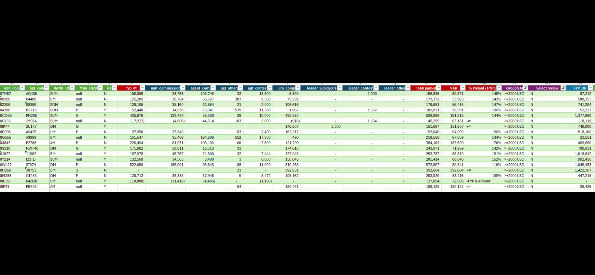

# MAC Cost Simulation Data Table

*Screenshot of a spreadsheet/Excel table with colored column headers showing MAC payout and compensation data*

| unit_code | agt_code | RANK_CI | MBA_DESC | GT | fyp_dt | unit_commission | agent_comp | agt_others | agt_contes | um_comp | leader_SubdyGTF | leader_contest | leader_other | Total payout | VAR | % Payout / FYP D | Group VA | Select review | FYP DR |
|-----------|----------|---------|----------|----|--------|-----------------|------------|------------|------------|---------|-----------------|----------------|--------------|--------------|--------|-------------------|----------|---------------|--------|
| 0TM57 | AQ408 | SUM | null | N | 106,065 | 28,768 | 105,745 | 32 | 13,500 | 6,590 | - | 2,000 | - | 156,636 | 50,571 | 148% | >=2000 USD | N | 67,212 |
| 08966 | K4400 | BM | null | N | 125,209 | 36,704 | 56,567 | 303 | 6,500 | 79,098 | - | - | - | 179,172 | 53,963 | 143% | >=2000 USD | N | 508,353 |
| 02206 | 65359 | SDM | null | N | 120,195 | 35,160 | 32,884 | 21 | 2,000 | 106,616 | - | - | - | 176,681 | 56,485 | 147% | >=2000 USD | N | 741,204 |
| 0A386 | BP718 | SDM | P | Y | 52,440 | 14,056 | 73,341 | 539 | 11,376 | 1,967 | - | 1,552 | - | 102,831 | 50,391 | 196% | >=2000 USD | N | 52,223 |
| 0CQ66 | PN205 | SUM | G | Y | 435,078 | 122,487 | 58,500 | 28 | 10,000 | 435,880 | - | - | - | 626,896 | 191,818 | 144% | >=2000 USD | N | 1,377,890 |
| 0CL55 | JM984 | SUM | null | N | (17,922) | (4,606) | 44,514 | 103 | 5,000 | (916) | - | 1,164 | - | 45,259 | 63,181 | -∞ | >=2000 USD | N | (18,110) |
| 01P77 | 2U1K7 | DM | G | Y | - | - | - | - | - | 146,607 | 5,000 | - | - | 151,607 | 151,607 | +∞ | >=2000 USD | N | 748,000 |
| 0R996 | AS425 | UM | P | N | 97,950 | 27,540 | - | 83 | 2,400 | 162,017 | - | - | - | 192,040 | 94,090 | 196% | >=2000 USD | N | 518,100 |
| 0G555 | AS099 | BM | null | N | 151,547 | 35,406 | 164,808 | 552 | 17,300 | 490 | - | - | - | 218,556 | 67,009 | 144% | >=2000 USD | N | 23,551 |
| 04843 | E2768 | AM | P | N | 226,494 | 61,931 | 193,103 | 60 | 7,800 | 121,209 | - | - | - | 384,103 | 157,609 | 170% | >=2000 USD | N | 469,551 |
| 0S310 | NW746 | DM | G | Y | 171,982 | 50,811 | 18,516 | 33 | - | 174,610 | - | - | - | 243,971 | 71,989 | 142% | >=2000 USD | N | 709,931 |
| 01627 | 11962 | BM | null | Y | 167,978 | 46,767 | 21,600 | 32 | 7,444 | 177,945 | - | - | - | 253,787 | 85,810 | 151% | >=2000 USD | N | 1,018,642 |
| 0Y214 | I23TD | SUM | null | Y | 132,568 | 34,363 | 8,400 | 3 | 8,000 | 150,648 | - | - | - | 201,414 | 68,846 | 152% | >=2000 USD | N | 992,456 |
| 0W422 | ST074 | DM | P | N | 522,056 | 155,901 | 95,643 | 88 | 11,000 | 310,265 | - | - | - | 572,897 | 50,841 | 110% | >=2000 USD | N | 1,045,453 |
| 0H269 | 50753 | BM | S | N | - | - | - | 33 | - | 392,631 | - | - | - | 392,664 | 392,664 | +∞ | >=2000 USD | N | 1,422,367 |
| 0M288 | GT453 | DM | P | N | 120,713 | 35,335 | 57,946 | 9 | 5,472 | 105,167 | - | - | - | 203,929 | 83,216 | 169% | >=2000 USD | N | 447,218 |
| 0IR39 | K4ZDB | UM | null | Y | (110,000) | (31,418) | (4,486) | - | (1,190) | - | - | - | - | (37,094) | 72,906 | -FYP &-Payout | >=2000 USD | N | - |
| 01P41 | PB805 | AM | null | Y | - | - | - | 54 | - | 180,071 | - | - | - | 180,125 | 180,125 | +∞ | >=2000 USD | N | 28,426 |
