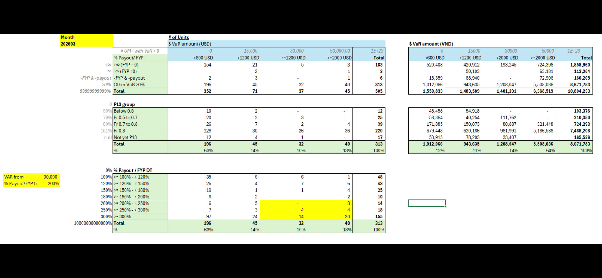

# Summary UM+ with VaR Positive in March

**Month: 202603**

## # of Units by $ VaR amount (USD) and $ VaR amount (VND)

| | # UM+ with VaR > 0 | **$ VaR amount (USD)** | | | | | **$ VaR amount (VND)** | | | | |
|---|---|---|---|---|---|---|---|---|---|---|---|
| | % Payout/ FYP | 0 <600 USD | 15,000 <1200 USD | 30,000 >=1200 USD | 50,000.00 >=2000 USD | 1E+23 **Total** | 0 <600 USD | 15000 <1200 USD | 30000 <2000 USD | 50000 >=2000 USD | 1E+23 **Total** |
| +∞ | +∞ (FYP = 0) | 154 | 21 | 5 | 3 | **183** | 520,408 | 420,912 | 193,245 | 724,396 | **1,858,960** |
| -∞ | -∞ (FYP <0) | - | 2 | - | 1 | **3** | - | 50,103 | - | 63,181 | **113,284** |
| -FYP & -payout | -FYP & -payout | 2 | 3 | - | 1 | **6** | 18,359 | 68,940 | - | 72,906 | **160,205** |
| >0% | Other VaR >0% | 196 | 45 | 32 | 40 | **313** | 1,012,066 | 943,635 | 1,208,047 | 5,508,036 | **8,671,783** |
| 9999999999% | **Total** | **352** | **71** | **37** | **45** | **505** | **1,550,833** | **1,483,589** | **1,401,291** | **6,368,519** | **10,804,233** |

## P13 group (0)

| | | 0 | 15,000 | 30,000 | 50,000.00 | **Total** | 0 | 15000 | 30000 | 50000 | **Total** |
|---|---|---|---|---|---|---|---|---|---|---|---|
| 50% | Below 0.5 | 10 | 2 | - | - | **12** | 48,458 | 54,918 | - | - | **103,376** |
| 70% | Fr 0.5 to 0.7 | 20 | 2 | 3 | - | **25** | 58,364 | 40,254 | 111,762 | - | **210,380** |
| 80% | Fr 0.7 to 0.8 | 26 | 7 | 2 | 4 | **39** | 171,885 | 150,073 | 80,887 | 321,448 | **724,293** |
| 101% | Fr 0.8 | 128 | 30 | 26 | 36 | **220** | 679,443 | 620,186 | 981,991 | 5,186,588 | **7,468,208** |
| null | Not yet P13 | 12 | 4 | 1 | - | **17** | 53,915 | 78,203 | 33,407 | - | **165,526** |
| | **Total** | **196** | **45** | **32** | **40** | **313** | **1,012,066** | **943,635** | **1,208,047** | **5,508,036** | **8,671,783** |
| | **%** | **63%** | **14%** | **10%** | **13%** | **100%** | **12%** | **11%** | **14%** | **64%** | **100%** |

## % Payout / FYP DT (0%)

*Highlighted in yellow:* **VAR from: 30,000** | **% Payout/FYP fr: 200%**

| | | 0 | 15,000 | 30,000 | 50,000.00 | **Total** |
|---|---|---|---|---|---|---|
| 100% | >= 100% - < 120% | 35 | 6 | 6 | 1 | **48** |
| 120% | >= 120% - < 150% | 26 | 4 | 7 | 6 | **43** |
| 150% | >= 150% - < 180% | 19 | 1 | 1 | 4 | **25** |
| 180% | >= 180% - < 200% | 6 | 2 | - | 2 | **10** |
| 200% | >= 200% - < 250% | 6 | 5 | - | 3 | **14** |
| 250% | >= 250% - < 300% | 7 | 3 | 4 | 4 | **18** |
| 300% | >= 300% | 97 | 24 | 14 | 20 | **155** |
| 100000000000000% | **Total** | **196** | **45** | **32** | **40** | **313** |
| | **%** | **63%** | **14%** | **10%** | **13%** | **100%** |

*Note: Cells highlighted in yellow indicate VaR >= 30,000 and % Payout/FYP >= 200% (rows for >= 200% - < 250%, >= 250% - < 300%, and >= 300% in the 30,000 and 50,000 columns)*
